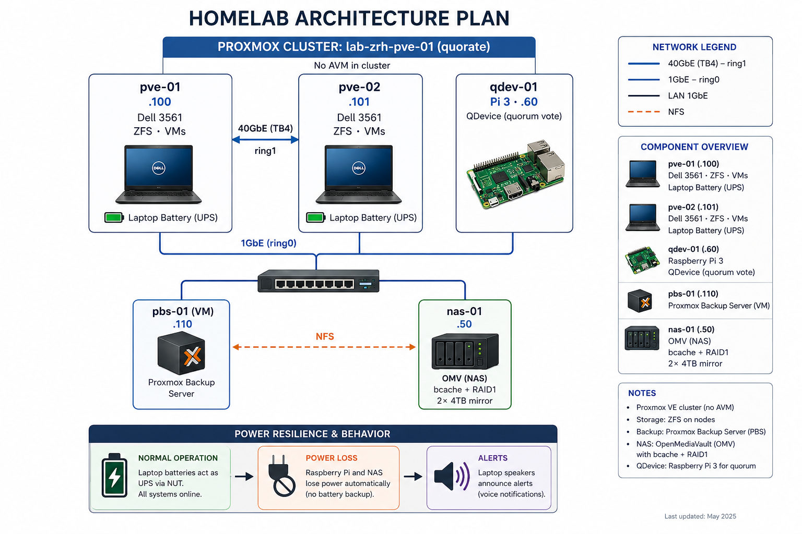

# Homelab — `lab-zrh-pve-01`

A two-node **Proxmox VE 9** cluster built on a pair of Dell Precision 3561
laptops, linked over a **40 GbE Thunderbolt 4** ring, with a Raspberry Pi
quorum device, an OpenMediaVault NAS as a backup target, and a custom
power-resilience system that turns the laptop batteries into a UPS.

Built in my apartment in Switzerland as hands-on preparation for a move into
Platform / DevOps / Cloud engineering. The goal was never "make it work" — it
was to build it the way a production environment would be built, and to break
enough things along the way to actually understand them.

---

## Architecture at a glance



| Host | Role | IP | Notes |
|------|------|-----|-------|
| `pve-01` | Proxmox node | 192.168.1.100 | Primary, NUT server |
| `pve-02` | Proxmox node | 192.168.1.101 | Secondary, NUT server |
| `qdev-01` | Quorum device | 192.168.1.60 | Raspberry Pi 3, NUT client |
| `pbs-01` | Backup server (VM) | 192.168.1.110 | Proxmox Backup Server |
| `nas-01` | Storage | 192.168.1.50 | OpenMediaVault, NUT client |

---

## Tech stack

- **Hypervisor:** Proxmox VE 9 (Debian 13 Trixie base)
- **Cluster interconnect:** Thunderbolt 4 (40 GbE), dual-ring Corosync
- **Storage (nodes):** ZFS (RAID0 single-disk per node), ZFS replication between nodes
- **Storage (NAS):** OpenMediaVault — bcache-accelerated mdadm RAID1 on 2× 4 TB HDD, 256 GB NVMe cache
- **Backups:** Proxmox Backup Server → NFS → NAS, with prune + GC + verify schedules
- **Quorum:** Corosync QDevice on a Raspberry Pi 3 (3-vote tiebreaker)
- **Power resilience:** Network UPS Tools (NUT), laptop batteries presented as a UPS
- **Conventions:** structured naming standard, segmented IP plan

---

## Design principles I held to

A few rules shaped every decision:

- **Name things like production.** Cluster `lab-zrh-pve-01` (`env-location-purpose-NN`), hosts `role-NN.zone.lootregen.com`. VMID last digits match the IP's last octet so any ID implies its address and role.
- **One source of truth.** IP reservations live on the router. Passwords defined once and referenced, never re-typed. State that drifts is state that breaks.
- **Verify, don't assume.** "The job said success" is not the same as "I restored it and it booted." Every critical step has an explicit proof.
- **Least privilege.** The backup service account can write and restore but cannot delete — append-only backups are ransomware-resistant by design.
- **Park good ideas, don't chase them.** New ideas go on a roadmap, not into the work in progress.

---

## Phase 1 — Proxmox install (both nodes)

Installed Proxmox VE 9 on both Dell Precision 3561 laptops.

**Key choices:**
- **ZFS (RAID0)** per node — enables snapshots and `zfs send/recv` replication later
- **ARC capped at 4 GB** — caching without starving VM memory (32 GB total)
- **hdsize trimmed ~100 GB** below disk size — SSD over-provisioning + avoids ZFS's >80%-full performance cliff
- **Secure Boot left ON** — PVE 9 supports it; disabling is outdated folklore
- Post-install: swap enterprise repo → no-subscription, remove the subscription nag, set `HandleLidSwitch=ignore` (closing a laptop lid must **not** suspend a cluster node), enable IOMMU for future GPU passthrough

> ### 💥 Lesson learned — renaming a node with running VMs
> I renamed the default `proxmox` host to `pve-01` **after** it already had VMs.
> Proxmox treats a renamed node as a brand-new one: the VMs "vanished" into a
> ghost node directory. Fix was moving the VM configs from
> `/etc/pve/nodes/proxmox/qemu-server/` to the new node's directory and deleting
> the ghost. **Takeaway:** name nodes correctly at install time; renaming after
> VMs exist means stopping them and moving configs first. The VM disks were never
> at risk (they live in ZFS, not in `/etc/pve`) — but it taught me exactly how
> Proxmox's clustered config filesystem works.

---

## Phase 2 — Cluster + Thunderbolt ring

Linked the two laptops directly over a Thunderbolt 4 cable and formed the cluster.

**Steps:**
- Loaded `thunderbolt-net`, persisted it, gave each end a `/30` (10.10.10.1 / .2, MTU 65520)
- Created the cluster with **two Corosync rings**: ring0 over the 1 GbE LAN, ring1 over the 40 GbE TB4 link (TB4 as primary via lower priority number)
- Set the **migration network** to the TB4 subnet so live migrations use 40 GbE

**Measured:** ~15 Gbit/s single-stream over the cheap TB4 cable (MTU 65520 confirmed it negotiated as true Thunderbolt, not a USB fallback). More than enough — Corosync needs kilobytes, and even a large VM migrates in seconds. Decided **not** to chase the theoretical max; the link wasn't the bottleneck.

> ### 💥 Lesson learned — `pvecm add` by IP fails TLS
> Joining the second node by IP gave `500 hostname verification failed`.
> Proxmox certificates are issued for the FQDN, so connecting by IP fails the
> hostname check. **Fix:** ensure both nodes resolve each other by name
> (`/etc/hosts`) and join by hostname, not IP. **Rule I now follow:** always use
> FQDNs in cluster commands, never raw IPs.

---

## Phase 3 — Raspberry Pi quorum device

A two-node cluster has a fatal flaw: if one node dies, the survivor has only
1 of 2 votes and **loses quorum** — it won't start VMs. A third vote fixes this.

- Installed `corosync-qnetd` on a Raspberry Pi 3, `corosync-qdevice` on both nodes
- Registered with `pvecm qdevice setup`
- Result: **3 votes, quorum 2** — the cluster now survives the loss of *any* single member (pve-01, pve-02, or the Pi)

The Pi's flags read `A,V,NMW` — Alive, Voting, Not-Master-Wins. If the two nodes
partition, whichever can still reach the Pi keeps running; the other fences
itself. This is the same split-brain-prevention algorithm enterprise clusters
use, running on a $35 board.

The Pi does *exactly one job* — it votes. Single responsibility, kept boring and
reliable on purpose.

---

## Phase 4 — Backups: Proxmox Backup Server + NAS

The NAS already existed (built before this project), so this phase was about
**integrating an inherited system** rather than building greenfield — which is
what most real platform work actually looks like.

**What the NAS is:** an Intel N100 running OpenMediaVault, with a clever storage
stack I chose to keep rather than rebuild:
- 2× 4 TB HDD in **mdadm RAID1** (mirror, survives one disk failure)
- A 256 GB NVMe as a **bcache** layer accelerating reads/writes on the mirror
- ext4 on top

> Keeping a working inherited architecture and documenting *why* is more honest —
> and more useful — than wiping it to chase purity. The bcache+RAID1 setup is a
> block-level analogue of ZFS L2ARC; it works well, so it stayed.

**The pipeline:**
```
Proxmox VMs → PBS VM (pbs-01) → NFS → OMV NAS → bcache → mdadm RAID1
```

**Decisions worth explaining:**

- **NFS, not SMB.** PBS's chunked, hard-linked, extended-attribute datastore
  format simply does not work reliably over SMB — and SMB breaks sparse files and
  fsync semantics for VM disks. NFS is the only correct choice for hypervisor and
  backup storage. SMB stays, but only for client file shares.
- **`sync`, not `async`.** Faster `async` risks losing in-flight writes on power
  loss, and the NAS has no UPS (yet). For backup integrity, durability beats
  speed. Documented as "revisit once a UPS exists."
- **`no_root_squash`, justified.** PBS needs root to own its backup chunks. Safe
  here because the NFS export is IP-restricted to only the cluster + PBS hosts.
- **Append-only backup account.** The service account Proxmox uses has the
  `DatastoreBackup` role — it can write and restore but **cannot delete**. If a
  node is ever compromised, the attacker can't wipe the backups. Space is managed
  by scheduled prune + garbage-collection jobs run by the admin, not by handing
  delete rights to an exposed credential. This is the immutable-backup pattern
  enterprises pay for.

> ### 💥 Lesson learned — a "successful" backup that backed up nothing
> My first backup finished in **1 second** and reported success. Reading the log:
> `backup contains no disks — starting diskless backup`. The VM's disk had a
> `backup=0` flag, so PBS dutifully backed up only the config. The job *was*
> successful — it just wasn't *useful*. **Takeaways:** (1) job success ≠ useful
> backup — check the duration and the "contains X GiB" line; (2) this is exactly
> why a **restore test is non-negotiable** — only restoring a backup and booting
> it proves the backup is real. I now restore to a throwaway VMID and boot it
> before trusting any backup chain.

**Schedules in place:** daily backup (02:00), prune (keep 3 / 7d / 4w / 3m),
garbage collection (03:30), weekly verify (re-checksums every chunk to catch
silent bit-rot before I ever need to restore).

**Still on the roadmap:** an offsite sync to reach full 3-2-1 compliance  right
now both copies live in the same apartment.

---

## Phase 4.5 — Power resilience with NUT (no UPS purchased)

The cluster runs on laptops, so the nodes have **built-in batteries**  but the
NAS and Pi die instantly on power loss. Rather than buy a UPS, I used the laptop
batteries *as* the UPS, with Network UPS Tools.

**The clever bit:** NUT expects real UPS hardware. A laptop battery isn't one, so
I wrote a bridge script that reads the kernel's battery + AC state
(`/sys/class/power_supply/`) and feeds it into NUT's `dummy-ups` driver  making
the laptop battery *look like* a UPS to the whole NUT network.

**How it behaves on power loss:**
1. Laptop switches to battery → bridge writes `OB` (on battery) → NUT broadcasts
2. **Node speaker announces** via `espeak`: *"Warning, pve-01 is running on battery"*
3. As charge drops, escalating voice alerts at 30% and 20%
4. At the low-battery threshold → **graceful shutdown** of the NAS and Pi (NUT
   clients), then the nodes themselves, VMs shut down cleanly first
5. If mains returns → shutdown cancelled, *"all clear"* announced

**Why node speakers, not the Pi:** the laptops *are* the battery source, so it's
one hop from sensor to alert. The Pi stays single-purpose (quorum only). Two
laptops also means redundant audio in two rooms, free.

**Why local audio for late alerts:** an early 50% alert can use email/push while
internet's still up — but at 20% during a real outage, the modem is already dead.
Any alert that must fire during the event itself has to be **local**. Designing
the alert path to not depend on the thing that's failing is a core reliability
principle.

> ### 💥 Lessons learned — NUT is gloriously finicky
> This phase produced the most debugging, and the most learning:
> - **The background timer raced the driver.** My bridge ran every 10s via a
>   systemd timer, which collided with the driver re-reading the file —
>   "duplicate driver" / "driver not connected" chaos. Fix: stop the timer during
>   manual tests; make the bridge write **atomically** (temp file + `mv`).
> - **`dummy-once` vs `dummy-loop`.** The driver only re-reads live changes in
>   loop mode, which needs the state file named `.seq`, not `.dev`. Until I found
>   this, the "UPS" was frozen at 100%.
> - **FSD latches after a dry-run.** I tested the shutdown logic with a
>   logging-only stand-in (smart — never dry-run a real `shutdown -h` on a live
>   cluster). But the Forced-Shutdown flag latched, because the system never
>   actually powered off. Real outages clear it on the next boot; test runs need a
>   full NUT-stack restart. **Also caught:** my "restore the real script" step had
>   silently failed — I verified instead of assuming, and found the dry-run
>   version still in place. In a real outage it would have announced a test and
>   never shut down.
> - **Password mismatch = silent half-failure.** `upsmon` connected and read
>   status fine with a wrong password, but privileged actions (FSD) got
>   `ACCESS-DENIED`. The detection looked healthy while the shutdown would never
>   have fired. Fix: define each password **once** as a shell variable and write
>   it into both files from that single source — they physically can't drift.

The dry-run testing is what surfaced every one of these in a safe context instead
of during a 3am power cut. That's the whole point of testing the dangerous path
deliberately.

---

## Roadmap (parked, deliberately)

Good ideas captured for later instead of derailing current work:

- **VLAN segmentation** — separate storage / management / workload / IoT networks behind a managed switch + firewall (needs hardware; biggest single security upgrade)
- **PXE + automated install** — unattended Proxmox provisioning via `answer.toml` + netboot, true bare-metal-as-code
- **Offsite backup sync** — second PBS or object storage for full 3-2-1
- **Monitoring** — Prometheus + Grafana for cluster + power telemetry
- **Terraform + Ansible** — import existing VMs into IaC, day-2 config in playbooks
- **UPS hardware** — when it lands, the NUT config adapts in minutes (just point at real hardware instead of the battery bridge)

---

## What this taught me

The point of a homelab is that **I'm only breaking my own things.** Every failure
here — the ghost node, the diskless backup, the latched FSD, the silent password
mismatch — is a failure I now recognize instantly and would catch in a change
review before it becomes someone's incident. You can't learn "what happens when
you rename a node with running VMs" from a tutorial; you learn it by doing it,
watching it break, fixing it, and writing it down.

That's what this repo is: not a perfect build, but a documented one — decisions,
trade-offs, and mistakes, the way real infrastructure actually gets made.
